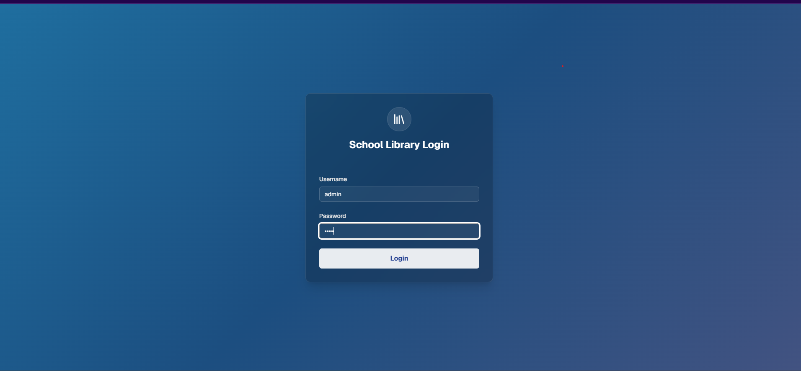
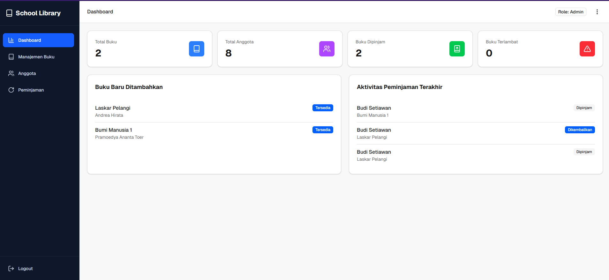
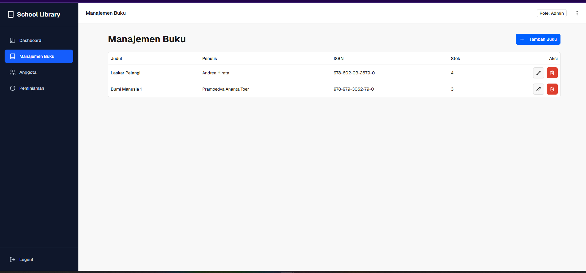
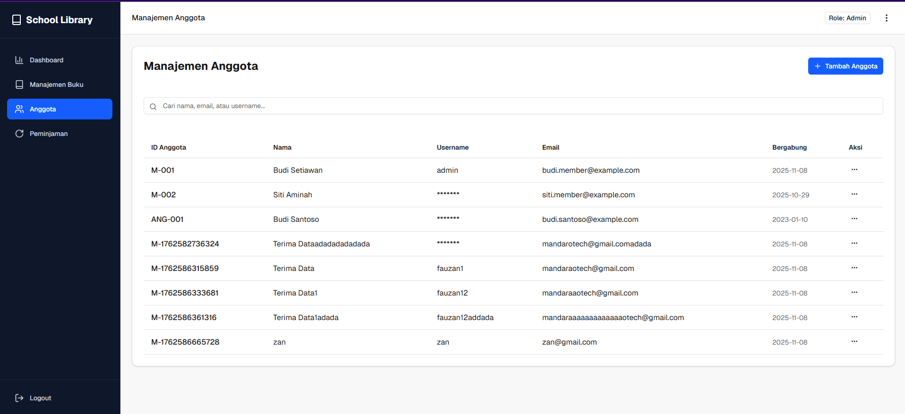
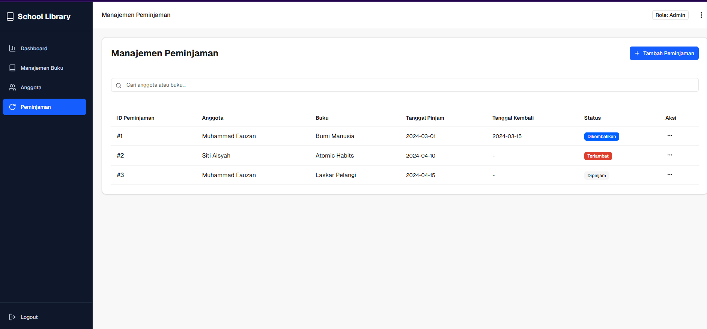

# School Library Management System

Ini adalah aplikasi web yang dirancang untuk mengelola operasi perpustakaan sekolah. Sistem ini menyediakan antarmuka yang bersih bagi administrator untuk mengelola inventaris buku, keanggotaan siswa, dan melacak transaksi peminjaman.

## Halaman Aplikasi dan Pratinjau

Berikut adalah pratinjau halaman login utama aplikasi.



(Catatan: Anda harus menempatkan gambar Anda, misalnya `image_d9be1b.jpg`, ke dalam folder di proyek Anda seperti `docs/` dan mengganti nama `login_page.png` di atas agar sesuai dengan path Anda.)

## Fitur Utama

Sistem ini mencakup beberapa modul utama untuk manajemen perpustakaan yang lengkap.

* **Halaman Login**
    Halaman otentikasi yang aman untuk administrator atau staf perpustakaan.

* **Dashboard Statistik**
    Halaman utama setelah login. Menampilkan ringkasan dan statistik penting, seperti jumlah total buku, jumlah anggota terdaftar, dan jumlah buku yang sedang dipinjam.


* **Manajemen Buku**
    Menyediakan fungsionalitas CRUD (Create, Read, Update, Delete) penuh untuk katalog buku perpustakaan. Administrator dapat menambah buku baru, mengedit detail buku yang ada, atau menghapus buku dari sistem.

* **Manajemen Anggota**
    Menyediakan fungsionalitas CRUD (Create, Read, Update, Delete) penuh untuk mengelola data anggota perpustakaan (siswa atau staf).

* **Manajemen Peminjaman**
    Modul untuk mengelola proses peminjaman dan pengembalian buku. Ini termasuk mencatat peminjaman baru (check out) dan menandai buku sebagai telah dikembalikan (check in).

## Teknologi Yang Digunakan

* **Frontend:** Next.js (React)
* **Styling:** Tailwind CSS
* **Komponen UI:** shadcn/ui
* **Backend:** Spring Boot
* **Database:** PostgreSQL

## Instalasi dan Menjalankan

Ikuti langkah-langkah ini untuk menjalankan proyek secara lokal.

### Prasyarat

* Node.js (versi 18 atau lebih baru)
* Java JDK (versi 17 atau lebih baru)
* PostgreSQL

### Menjalankan Frontend (Next.js)

1.  Buka terminal di direktori frontend.
2.  Instal dependensi:
    ```bash
    npm install
    ```
3.  Jalankan server pengembangan:
    ```bash
    npm run dev
    ```

### Menjalankan Backend (Spring Boot)

1.  Buka proyek backend di IDE Anda (misal: IntelliJ IDEA atau VS Code).
2.  Konfigurasikan koneksi database Anda di file `application.properties`.
3.  Jalankan aplikasi Spring Boot.